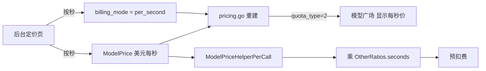

# 新增「按秒计费」模型定价类型

> 状态：已实现，待验收  
> 日期：2026-08-05  
> 分支：`feat/silkroad-newapi-video`

## 概述

新增独立的「按秒计费」类型，与现有「按次 / 按量 / 表达式」并列；固定价仍存 `ModelPrice`，用 `billing_mode=per_second` 区分展示与语义，视频任务现有「单价 × seconds」扣费逻辑保持不变。

## 为什么不用表达式

`billingexpr` 面向 token 对话模型（`p`/`c`，`$ / 1M → 额度`）。视频任务走的是 `ModelPriceHelperPerCall`（`relay/helper/price.go`），**不会读取** `billing_expr`。表达式不能直接当成「$/秒」来用。

## 方案

新增第四种定价模式 **按秒（Per-second）**，与「按次」分开：

- **按量（Per-token）**：存 `ModelRatio`；广场 `quota_type=0`；按 token 展示与扣费
- **按次（Per-request）**：只存 `ModelPrice`；广场 `quota_type=1`；展示 `$x / 次`；按次扣费（部分任务适配器仍可能带 OtherRatios）
- **按秒（Per-second）**：存 `ModelPrice` + `billing_setting.billing_mode[model]=per_second`；广场 `quota_type=2`；展示 `$x / 秒`；扣费为 `ModelPrice × 分组倍率 × seconds`（沿用现有 Seedance 路径）
- **表达式（Expression）**：`billing_mode=tiered_expr` + 表达式；广场动态展示；走 token 表达式结算

Seedance/New API 已通过 `EstimateBilling`（`relay/channel/task/newapi/request_build.go`）+ `ApplyOtherRatios`（`relay/relay_task.go`）做 `基础额度 × seconds`。**扣费公式不用改**，只改后台模式标记与广场展示类型。

## 后端

1. `setting/billing_setting/tiered_billing.go`
   - 增加常量 `BillingModePerSecond = "per_second"`。
2. `model/pricing.go`（重建定价列表）
   - 命中 `GetModelPrice` 时：
     - 若 `GetBillingMode(model) == per_second` → `QuotaType = 2`，保留 `ModelPrice`，并透出 `BillingMode=per_second`
     - 否则 → `QuotaType = 1`（原按次逻辑不变）
3. `ModelPriceHelperPerCall` / Seedance `EstimateBilling` **不改**（`$ / 秒 × 秒数` 已正确）。
4. `controller/ratio_sync.go`：上游同步时 `quota_type=2` 写入 `ModelPrice`，并保留 `billing_mode=per_second`。

## 管理后台（系统设置 → 模型）

1. `web/src/features/system-settings/models/model-pricing-core.ts` 扩展 `PricingMode`：加入 `'per-second'`。
2. `web/src/features/system-settings/models/model-pricing-sheet.tsx`
   - 增加 **按秒** Tab（四列）。
   - 表单：单个美元价格字段，说明为「视频每秒的美元单价」。
3. `web/src/features/system-settings/models/model-ratio-visual-editor.tsx` 保存逻辑
   - 保存前先 **删除** 该模型的 `billing_mode` / `billing_expr` 键，再按模式写入：
     - `per-second` → 写 `ModelPrice`，且 `billingModeMap[name] = 'per_second'`
     - `per-request` → 写 `ModelPrice`，**不**写回 `per_second`（键保持删除，避免从按秒切回按次时粘住）
     - `tiered_expr` → 保持现状
4. `web/src/features/system-settings/models/model-pricing-snapshots.ts`
   - 当 `billing_mode[model] === 'per_second'` 时推断为 `billingMode: 'per-second'`。
   - 文案摘要：`$x / 秒`、「固定按秒价格」。

## 模型广场

1. `web/src/features/pricing/constants.ts`：`QUOTA_TYPE_VALUES.SECOND = 2`，筛选项「按秒」。
2. `web/src/features/pricing/lib/price.ts` 及卡片/表格/详情：
   - `quota_type === 2` 时按按次价公式格式化，后缀改为 `/ 秒`（仍用 `model_price × 分组倍率`）。
3. `web/src/features/pricing/components/model-billing-mode-badge.tsx`：徽章「按秒」。
4. 侧边栏/筛选统计纳入新类型。

## 运营注意（重要）

- Seedance / New API 视频适配器的 `EstimateBilling` **不论**后台标成按次还是按秒，都会乘 `seconds`。因此视频模型必须配置为 **按秒**，否则广场显示 `$x / 次`、实际仍按秒扣费。
- **存量迁移**：上线前已有 `ModelPrice` 的 Seedance 模型不会自动变成 `quota_type=2`，需在后台重新保存为「按秒」，或批量写入 `billing_setting.billing_mode[model]=per_second`。

## 国际化

通过 `add-missing-keys.mjs` + `bun run i18n:sync` 补充文案，例如：Per-second、Per Second、USD price per second、`/ sec`、Fixed per-second price 等（英文 key，各语言翻译）。

## 上线后如何配置 Seedance

1. 系统设置 → 模型 → 编辑模型（如 `dreamina-seedance-2-0-720p`）
2. 选择 **按秒**，填写例如 `0.02`
3. 广场显示 `$0.02 / 秒`；5 秒视频预扣约为 `0.02 × 5 × 分组倍率`（换算为额度）

真正「整次一口价」的模型继续用 **按次**，广场仍显示 `$x / 次`。

## 测试

- 后端：pricing 重建单测 — `ModelPrice + per_second` → `quota_type=2`；仅有 `ModelPrice` → `quota_type=1`
- 前端：快照推断 / 格式化辅助函数（能覆盖则补）
- NewAPI `EstimateBilling` 单测预期无需改动

## 实现待办

- [x] 后端增加 `billing_mode=per_second`，`pricing.go` 输出 `quota_type=2`
- [x] 管理后台定价表单/编辑器/快照：支持按秒模式的保存与回显
- [x] 模型广场常量、价格格式化、徽章、筛选支持 `quota_type=2`
- [x] 补充 i18n 文案 + pricing 重建单测

> 状态：已实现，待验收
